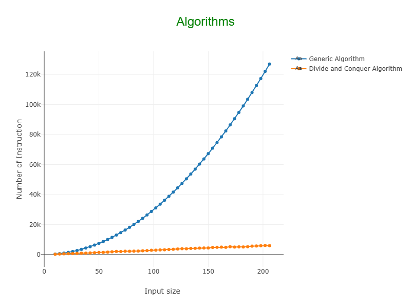

# Algorithms Problem-Solving Strategy

[](https://www.oracle.com/java/)
[](LICENSE)

This project was developed as part of the coursework for the subject  
**IC0004 - Algorithms and Graphs** at the **Federal University of Bahia (UFBA)**.  
It presents solutions to five classic Computer Science problems, each implemented with two distinct approaches:  
one based on the **divide and conquer** technique and another alternative for experimental comparison.

## ✍️ Author

- Iarley Moraes

## 🎯 Purpose

Compare algorithmic problem solutions using different strategies, measuring computational performance and  
analyzing their worst-case complexity.

The central idea is to contrast generic algorithm implementations with algorithm design techniques, evaluating  
the practical gains provided by various strategies such as  
**Divide and Conquer**, **Backtracking**, **Dynamic Programming**, and **Greedy Algorithms**.

## 📘 Problems Addressed So Far:

Each problem is located in a specific package and is implemented with at least two different strategies:

| Code (package) | Problem                                  | Techniques Used                                |
|----------------|-------------------------------------------|------------------------------------------------|
| p01            | Closest pair of points                    | Divide and Conquer vs. Brute Force             |
| p02            | Large integer multiplication              | Karatsuba vs. Traditional multiplication       |
| p03            | Binary search where index equals value    | Binary search vs. Linear search                |
| p04            | Ordered union of vectors                  | Logarithmic search vs. Merge + Sort            |
| p05            | Majority element detection                | Boyer-Moore vs. Divide and Conquer             |

---

## 📦 Project Structure

The project is a **Java with Maven** application that can be packaged and executed as a `.jar` file.

- All problem cases are numbered from 1 to N and placed in packages from `p1` to `pN` with their respective <IPS> (Input Processed by the Solution).
- For each problem case, there is a `Solution1.java` to `SolutionN.java` class that executes all algorithm strategies implemented for that problem.
- **IMPORTANT ─ The package structure of problem cases must not be changed to avoid breaking the package scanning system.**

```aiignore
src/
└── main
│ ├── java
│ │ └── br.ufba.pos
│ │ │ ├── charts
│ │ │ ├── executors
│ │ │ ├── problems
│ │ │ │ └── p1/ a p5/ ...
│ │ │ ├── readers
│ │ │ ├── solution
│ │ │ │ └── Solution1.java to Solution5.java ...
│ │ │ ├── Main.java
│ │ │ ├── Helper.java
```

---

## 🚀 Executando o Projeto

The project can be run in two ways:
1. Through your preferred IDE by executing a Launcher with the necessary arguments
2. By building the project and executing the generated JAR file

### 📌 Requirements
- Java 17
- Maven 3.8+

#### Dependencies used

- tablesaw
- commons-lang3

### 🔧 Building the JAR

Open your preferred terminal and run the commands:

1. `mvn clean package install` – The JAR file will be generated in `target/algorithms_pss.jar`
2. `java -jar target/algorithms_pss.jar --help`  to learn how to execute.

## Running
When executing the project, some information is printed to the terminal, including the data being processed by
each of the implemented strategies for the given solution.

At the end of the problem execution, your default web browser will open one tab per solution with a plot
showing the asymptotic analysis of each implemented strategy.



### Comandos
- To execute a specific problem case, run a command like:

`java -jar target/algorithms_pss.jar --problems -p1 50 4`

- To view help for the parameters of a specific Case Problem:

`java -jar target/algorithms_pss.jar --problems -p1 -h`

- To run a Case Problem using default parameters:

`java -jar target/algorithms_pss.jar --problems -p1`

- You can run multiple Case Problems simultaneously:

`java -jar target/algorithms_pss.jar --problems -p1 50 4 -p2 40 5`

## 📈  Experimental Comparisons
The results of the empirical comparisons between strategies for each problem are detailed in the report IC0004_Trabalho_01.pdf. Some relevant notes:

- Divide and Conquer algorithms showed significant performance gains in problems like Q01 (closest pair) and Q02 (Karatsuba).

- For small inputs, simpler techniques may be competitive or even faster.

## 🧠 Key Concepts
Divide and Conquer

Asymptotic complexity analysis

Brute-force strategies

Experimental performance analysis

Processing large inputs with empirical measurements

## 🤝 Contributions Welcome

Feel free to contribute with new problem cases and algorithm strategies, respecting the current package structure.

---

## 📄 License
This project is licensed under the MIT License.

---

## 📚 References
Kleinberg & Tardos, Algorithm Design

Cormen et al., Introduction to Algorithms

IC0004 course notes and material

---